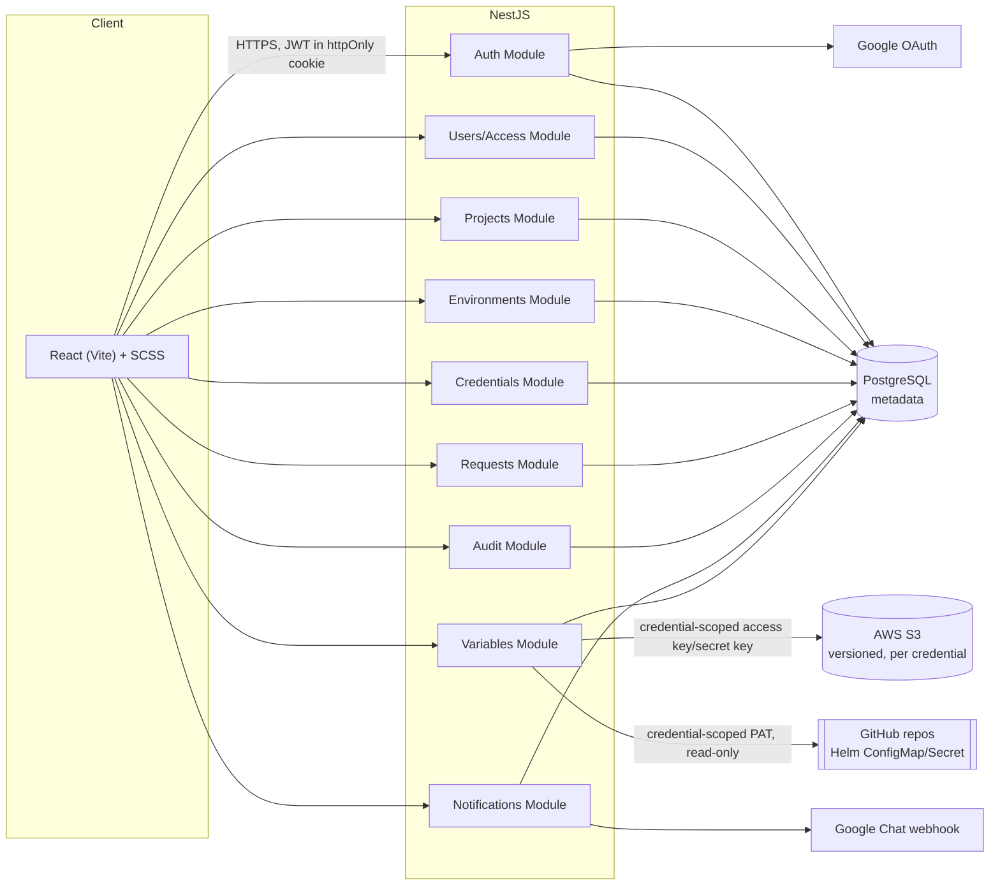
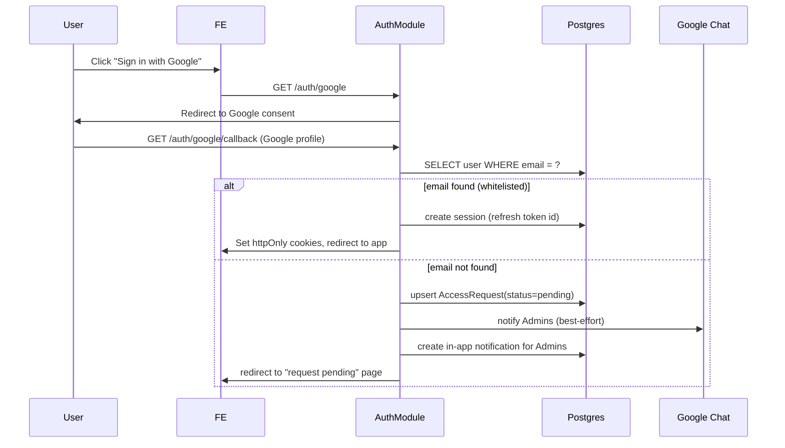
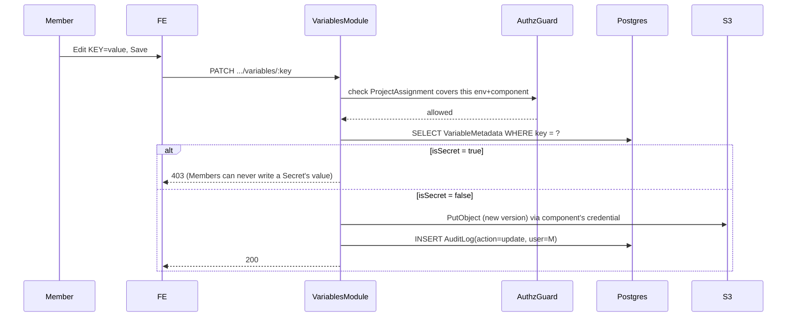
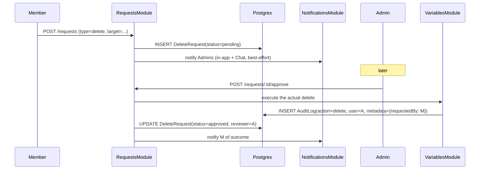

# Kosha — High-Level Design

See [TRD](TRD.md) for tech stack and the security/data-model decisions this design implements, and [LLD](LLD.md) for the concrete schema and API contract.

## System architecture

Two data planes, one metadata store — see [TRD — Architecture](TRD.md#architecture) for the rationale. Postgres never holds a secret's actual value; S3 is the source of truth for S3-backed values; GitHub is read live at request time for GitHub-backed components and never written to.

## Module boundaries (NestJS)

One module per bounded concern, matching the API grouping in [LLD](LLD.md#api-design):

| Module | Owns |
|---|---|
| `AuthModule` | Google OAuth callback, whitelist check, JWT issue/refresh/revoke, single-session enforcement |
| `UsersModule` | User records, roles, deactivation, `ProjectAssignment`s, pending `AccessRequest`s |
| `ProjectsModule` | Projects and `ProjectComponent`s |
| `EnvironmentsModule` | Environments and `EnvironmentComponentConfig`s (S3/GitHub connection setup) |
| `VariablesModule` | Variable read/write/import/diff/history/rollback against S3 or GitHub, Secret masking, `VariableMetadata` |
| `CredentialsModule` | AWS/GitHub credential storage, usage lookup, deletion warning |
| `RequestsModule` | `DeleteRequest` / `RollbackRequest` creation and Admin approval/rejection |
| `AuditModule` | Append-only `AuditLog` writes (called by every other module) and the `/audit-log` read API |
| `NotificationsModule` | In-app notifications feed + best-effort Google Chat webhook delivery |

A cross-cutting `AuthzGuard` (role + `ProjectAssignment` scope check) and a `SecretMaskingInterceptor` sit in front of every controller that can return variable data — these are shared, not duplicated per module, since [PRD — Non-functional requirements](PRD.md#non-functional-requirements) requires masking on *every* read path.

## Key flows

### 1. Sign-in (whitelisted vs. not)

### 2. Member edits a non-Secret variable

### 3. Member requests a delete → Admin approves

### 4. Admin reveals a Secret

Same guard path as flow 2, except the caller's role is checked *before* the masking step is even applied — the value is fetched from S3, an `AuditLog(action=reveal)` row is written, and only then is the value returned. There is no separate "hidden" endpoint a Member could hit to skip masking; masking is applied per-role inside the one variable-read path.

### 5. Bulk `.env` import

Two-step: `POST .../import/preview` parses the pasted/uploaded block (dedupe, strip `export`/quotes) and returns a proposed diff without writing anything; `POST .../import/commit` applies it. Existing Secret-flagged keys are excluded from what a Member's commit can overwrite — the commit endpoint re-checks `VariableMetadata.isSecret` server-side rather than trusting whatever the preview step showed the client.

## Deployment view

Kosha runs as one deployable unit (frontend + backend + Postgres) inside Divami's own infrastructure — it does not need to be deployed per-client. It reaches into any AWS account or GitHub org purely through the access-key/secret-key or PAT stored in that connection's `Credential` row; Kosha's own hosting location is independent of where the projects it manages actually run. See [TRD — Deployment shape](TRD.md#deployment-shape).
