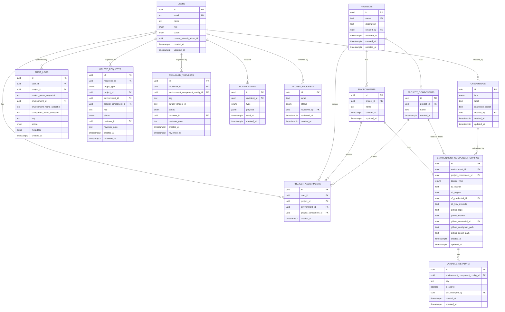

# Kosha — Low-Level Design

Concrete database schema and API contract implementing [HLD](HLD.md), [PRD](PRD.md), and [TRD](TRD.md). This is the level a migration or a controller gets written against — if something here conflicts with the PRD/TRD, those win and this file gets corrected.

## Database schema

### ER diagram

### Table notes

- **`users` doubles as the whitelist.** There is no separate `whitelist_entries` table — "whitelisted" simply means a `users` row exists for that email (see [HLD — Sign-in flow](HLD.md#1-sign-in-whitelisted-vs-not)). Approving an `access_requests` row creates the `users` row.
- **`project_components`** is normalized out of `projects` specifically so `environment_component_configs.project_component_id` can be a real FK (see [TRD — Data model](TRD.md#data-model)). `ON DELETE RESTRICT` on that FK — deleting a component that still has a config attached is a DB-level 409, not an app-level check.
- **`environment_component_configs`** has both an `s3_*` and a `github_*` column group; exactly one group is populated per row, selected by `source_type`. Enforced with a `CHECK` constraint (`source_type = 's3' AND github_repo IS NULL`, etc.) rather than two separate tables — one row per (environment, component) either way, and a `CHECK` is a native DB feature, not custom code.
- **`credentials.id` has no `ON DELETE RESTRICT`** from `environment_component_configs` — deletion is a plain `DELETE`, not blocked, matching the decision in [PRD — Credential](PRD.md#core-entities): the API warns by listing referencing configs first, but doesn't prevent it.
- **`audit_logs`** stores `project_id`/`environment_id` as nullable FKs with `ON DELETE SET NULL`, plus denormalized `*_snapshot` text columns — so a deleted project/environment doesn't take its audit history down with it, and the log still reads sensibly after the fact. `users.id` referenced from `audit_logs`, `delete_requests`, `rollback_requests` is never hard-deleted (deactivation only — see [PRD — Members/users management](PRD.md#10-members--users-management-admin-only)), so those FKs stay valid indefinitely within the 7-day audit retention window.
- **`project_assignments`** — a null `environment_id` means "all environments in this project"; a null `project_component_id` means "all components in that environment." Application-layer uniqueness check on the effective tuple (Postgres doesn't dedupe NULLs via a plain `UNIQUE` constraint) — not worth a partial-index per nullable combination for a table this small and admin-curated.
- **Uniqueness constraints** (each a plain `UNIQUE`, not just an index — these are invariants, not performance tuning): `project_components(project_id, name)`, `environments(project_id, name)`, `environment_component_configs(environment_id, project_component_id)` — the DB-level expression of "one connection per (environment, component)" from [PRD](PRD.md#core-entities) — and `variable_metadata(environment_component_config_id, key)`.
- **GitHub-sourced configs are read-only everywhere, not just at the UI layer.** Every write endpoint under [Variables](#variables) (`POST`/`PATCH`/`DELETE` on a variable, the secret-flag patch, `reveal`, `rollback`, both import steps) checks `environment_component_configs.source_type` first and rejects with `403` if it's `github` — Kosha has no code path that writes to a GitHub-sourced config, for any role. `RollbackRequest.environment_component_config_id` is likewise only ever created against an `s3`-sourced config; there's nothing to roll back on a source Kosha never versions.
- **GitHub Secret-manifest values are never fetched, for any role, not just masked for Members.** This is stricter than the S3 `isSecret` masking: an S3 Secret is masked *in the response* to a Member but the backend still has the real value in hand (so an Admin's request or a `reveal` call gets it). A GitHub Secret manifest's values are never read off GitHub in the first place, for anyone — only the key names in that manifest are ever parsed out. `reveal` and `/history` therefore don't apply to GitHub-sourced configs at all (not "Admin gets the value," there is no value to get).
- **Enums**: `users.role` (`admin`, `member`), `users.status` (`active`, `pending`, `deactivated`), `credentials.type` (`aws`, `github`), `environment_component_configs.source_type` (`s3`, `github`), `variable_metadata` has no status enum (just `is_secret` boolean), `audit_logs.action` (`create`, `update`, `delete`, `rollback`, `reveal`, `import`), `delete_requests.target_type` (`variable`, `component`, `environment`, `project`) — `component` covers deleting one `EnvironmentComponentConfig` (a dedicated value, not inferred from which columns on `environment` happen to be null — see [Requests](#requests-deleterollback-approval)), `delete_requests.status` / `rollback_requests.status` / `access_requests.status` (`pending`, `approved`, `rejected`), `notifications.type` (`access_request_created`, `access_request_approved`, `access_request_rejected`, `delete_request_created`, `delete_request_approved`, `delete_request_rejected`, `rollback_request_created`, `rollback_request_approved`, `rollback_request_rejected`).
- **Retention** (see [PRD — Retention](PRD.md#retention)): a scheduled job deletes `audit_logs` rows older than 7 days; S3 noncurrent-version expiry after 7 days is a bucket lifecycle rule, not app code.
- All `timestamptz` columns store UTC; conversion to IST happens only in the frontend (see [CLAUDE.md](../CLAUDE.md)).

## API design

Base path assumed as `/api` (NestJS global prefix). Every route requires a valid access-token cookie unless marked **public**. `AuthzGuard` resolves role + `ProjectAssignment` scope before the handler runs; an out-of-scope request is `403` with no detail about the resource (see [PRD — Non-functional requirements](PRD.md#non-functional-requirements)). Error body shape: `{ statusCode, message, error }` (Nest's default `HttpException` shape — no custom envelope).

### Auth

| Method | Path | Role | Notes |
|---|---|---|---|
| GET | `/auth/google` | public | Redirects to Google consent screen |
| GET | `/auth/google/callback` | public | Whitelisted → sets access+refresh cookies. Not whitelisted → creates/updates `AccessRequest`, notifies Admins, redirects to pending page |
| POST | `/auth/refresh` | any (valid refresh cookie) | Rotates the access token; rejects if the refresh token isn't the user's current one (single-session enforcement) |
| POST | `/auth/logout` | any | Clears both cookies, clears `users.current_refresh_token_id` |
| GET | `/auth/me` | any | `{ id, email, role, assignments[] }` |

### Access requests (whitelist pending queue)

| Method | Path | Role | Notes |
|---|---|---|---|
| GET | `/access-requests?status=pending` | Admin | List pending sign-in requests |
| POST | `/access-requests/:id/approve` | Admin | Body: `{ role, assignments: [{projectId, environmentId?, projectComponentId?}] }` — creates the `users` row |
| POST | `/access-requests/:id/reject` | Admin | Body: `{ note? }` |

### Users / members (global "Members" tab)

| Method | Path | Role | Notes |
|---|---|---|---|
| GET | `/users` | Admin | Global list, mirrors Credentials tab UX |
| GET | `/users/:id` | Admin | Includes assignments |
| PATCH | `/users/:id` | Admin | Body: `{ role? }` |
| POST | `/users/:id/deactivate` | Admin | Invalidates refresh token, blocks login, keeps assignments/history intact |
| POST | `/users/:id/reactivate` | Admin | Restores prior assignments as-is |
| POST | `/users/:id/assignments` | Admin | Body: `{ projectId, environmentId?, projectComponentId? }` |
| DELETE | `/assignments/:id` | Admin | Removes one `ProjectAssignment` |

### Projects & components

| Method | Path | Role | Notes |
|---|---|---|---|
| GET | `/projects` | any | Admin sees all; Member sees only assigned projects |
| POST | `/projects` | Admin | Body: `{ name, description }` |
| GET | `/projects/:id` | scoped | 403 if Member has no assignment on this project |
| PATCH | `/projects/:id` | Admin | |
| DELETE | `/projects/:id` | Admin: direct. Member: `202`, `DeleteRequest(target_type=project)` | Matches [PRD — Feature 6](PRD.md#6-delete--rollback-approval-workflow), which allows a Member to request deletion of a variable, environment, *or* project — approval risk is what gates this, not whether a Member can trigger the request |
| POST | `/projects/:id/components` | Admin | Body: `{ name }` |
| DELETE | `/projects/:id/components/:componentId` | Admin | `409` if any `EnvironmentComponentConfig` still references it (FK `RESTRICT`) |

### Environments & component configs

| Method | Path | Role | Notes |
|---|---|---|---|
| GET | `/projects/:id/environments` | scoped | |
| POST | `/projects/:id/environments` | Admin | Body: `{ name }` |
| GET | `/environments/:id` | scoped | |
| DELETE | `/environments/:id` | Admin: direct delete + `AuditLog`. Member: `202`, creates `DeleteRequest(target_type=environment)` | |
| GET | `/environments/:id/components` | scoped | Component picker is populated from the parent project's `project_components` |
| POST | `/environments/:id/components` | Admin | Body: `{ projectComponentId, sourceType, s3?: {...}, github?: {...} }` |
| PATCH | `/environments/:id/components/:configId` | Admin | |
| DELETE | `/environments/:id/components/:configId` | Admin: direct. Member: `202`, `DeleteRequest(target_type=component)` | Distinct from the whole-environment delete above — see the `target_type` enum note under [Database schema](#table-notes) |

### Variables

Every endpoint below except the plain `GET` is **S3-sourced configs only**. If `environment_component_configs.source_type = 'github'` for the target `:configId`, every write/reveal/history/rollback/import call returns `403 { error: 'read_only_source' }` before touching anything else — role doesn't matter, Admin included. This is the API-level expression of "GitHub is read-only by design" from [PRD — Feature 8](PRD.md#8-eksgithub-read-only-source).

| Method | Path | Role | Notes |
|---|---|---|---|
| GET | `/environments/:envId/components/:configId/variables` | scoped | S3 source: masks any `isSecret` value for a Member, real value for Admin. GitHub source: ConfigMap keys+values readable by anyone in scope; Secret-manifest entries return **key names only, for every role including Admin** — the value is never fetched from GitHub in the first place, so there's nothing to unmask |
| POST | `/environments/:envId/components/:configId/variables` | scoped, write, **S3 only** | Body: `{ key, value }`. New variable defaults `isSecret=false` |
| PATCH | `.../variables/:key` | scoped, write, **S3 only** | `403` if `isSecret=true` and caller is a Member |
| PATCH | `.../variables/:key/secret-flag` | **Admin only**, **S3 only** | Body: `{ isSecret }` — the only path that can change this field |
| DELETE | `.../variables/:key` | Admin: direct, **S3 only**. Member: `202`, `DeleteRequest(target_type=variable)` | |
| GET | `.../variables/:key/history` | scoped, **S3 only** | S3 version list; values masked per role exactly like the main read. No equivalent for GitHub source — there's no version history to show |
| POST | `.../variables/:key/reveal` | **Admin only**, **S3 only** | Fetches and returns the real value; writes `AuditLog(action=reveal)`. Doesn't exist for a GitHub-sourced Secret key — there is no fetched value to reveal |
| POST | `.../rollback` | Admin: direct, executes immediately, **S3 only**. Member: `202`, `RollbackRequest` | Body: `{ key?, targetVersionId }` — omitted `key` = whole-file rollback |
| POST | `.../import/preview` | scoped, write, **S3 only** | Body: raw pasted/uploaded `.env` text. Returns proposed create/update rows, deduped, with Secret-protected keys flagged as skipped |
| POST | `.../import/commit` | scoped, write, **S3 only** | Re-validates `isSecret` server-side before writing — never trusts the preview response |

### Diff

| Method | Path | Role | Notes |
|---|---|---|---|
| GET | `/diff?fromConfigId&toConfigId` | scoped (both sides) | Returns `{ onlyInFrom[], onlyInTo[], differing[], matching[] }` — every key on either side, not just the discrepancies — values masked per role. A GitHub-sourced side is fully readable for this comparison (subject to the same Secret-key-names-only rule as the main variable read) since diffing is a read |
| POST | `/diff/add-to-environment` | scoped, write on target, **target must be S3-sourced** | Body: `{ fromConfigId, toConfigId, key }` — copies value (non-Secret only) or just the key name (Secret). `403 read_only_source` if `toConfigId` resolves to a GitHub-sourced config — same rule as every other write in [Variables](#variables) |

### Requests (delete/rollback approval)

| Method | Path | Role | Notes |
|---|---|---|---|
| GET | `/requests?status=pending` | Admin | All pending `DeleteRequest`/`RollbackRequest` rows |
| GET | `/requests/mine` | any | Caller's own request history/status |
| POST | `/requests/:id/approve` | Admin | Body: `{ note? }` — executes the underlying action, then logs it |
| POST | `/requests/:id/reject` | Admin | Body: `{ note? }` |

### Credentials

| Method | Path | Role | Notes |
|---|---|---|---|
| GET | `/credentials` | Admin | Label + type only, never secret material |
| POST | `/credentials` | Admin | Body: `{ type, label, accessKeyId, secretAccessKey }` or `{ type: 'github', label, pat }` |
| PATCH | `/credentials/:id` | Admin | Rotates the underlying key/PAT; label editable too |
| GET | `/credentials/:id/usages` | Admin | Lists referencing `EnvironmentComponentConfig`s, powers the pre-delete warning |
| DELETE | `/credentials/:id` | Admin | Unconditional delete after the UI has shown `usages` |

### Audit log

| Method | Path | Role | Notes |
|---|---|---|---|
| GET | `/audit-log?projectId&userId&action&from&to` | Admin | Paginated; 7-day retention window means `from` can't predate that |

### Notifications

| Method | Path | Role | Notes |
|---|---|---|---|
| GET | `/notifications` | any | Caller's own feed |
| POST | `/notifications/:id/read` | any | |
| POST | `/notifications/read-all` | any | |

## Cross-cutting rules applied at the API layer

- **Masking** (`SecretMaskingInterceptor`): applied to the response of every endpoint under `/variables`, `/import`, `/diff`, and `/history` — one interceptor, not per-handler logic, so a new endpoint can't accidentally forget it.
- **Audit writes**: every mutating endpoint above calls the shared `AuditModule.record()` at the end of its handler, inside the same DB transaction as the mutation itself — an action and its audit row are never allowed to succeed/fail independently.
- **Idempotent import**: `/import/commit` diffs against current state before writing; a key whose proposed value matches the current value is skipped, not written as a no-op `update` (see [TRD — Non-functional requirements](TRD.md#non-functional-requirements)).
